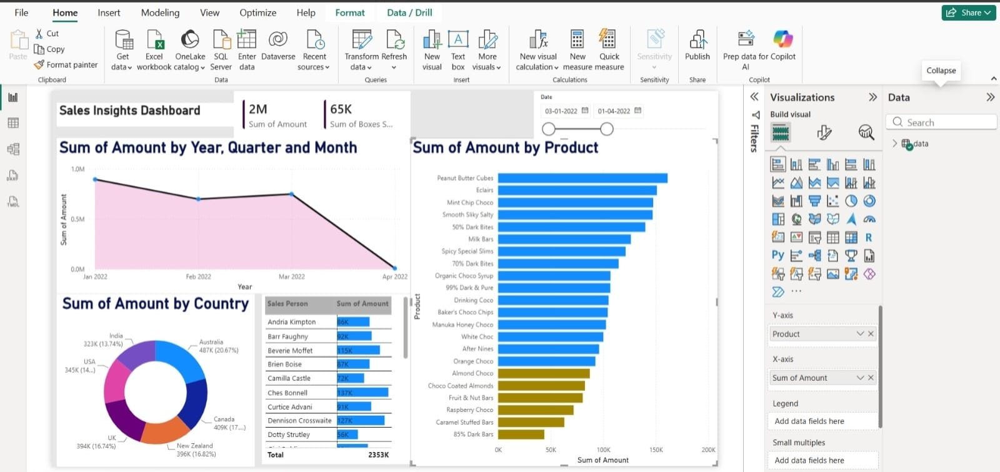

# 📊 Sales Insights Dashboard

## 📌 Project Overview

This project is an interactive Sales & Profit Analysis Dashboard created using Microsoft Power BI.

The dashboard helps analyze sales performance, profit, products, and business trends.

## 🛠️ Tools & Technologies

- Microsoft Power BI
- Excel
- SQL
- DAX
- Data Visualization

## 📈 Dashboard Analysis

The dashboard provides insights into:

- Total Sales
- Total Profit
- Sales trends
- Profit trends
- Product performance
- Category-wise analysis
- Regional performance

## 🎯 Project Objective

The objective of this project is to transform sales data into meaningful business insights using data cleaning, analysis, and interactive Power BI visualizations.

## 📷 Dashboard Preview

## 📂 Project Files

- `dashboard.powerbi.pbix` — Power BI dashboard file
- `dashboardbi.jpeg` — Dashboard preview

## 👩‍💻 Author

Shubhangi Rajendra Ingle
